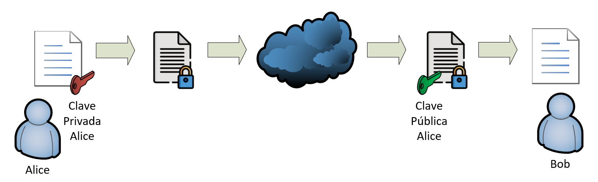
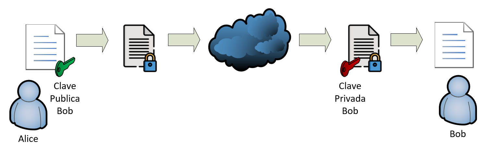

- [**Cifrado Asimétrico**](#cifrado-asimétrico)
  - [**Cómo funciona el cifrado asimétrico**](#cómo-funciona-el-cifrado-asimétrico)
    - [**Cifrado de mensajes**](#cifrado-de-mensajes)
    - [**No repudio**](#no-repudio)
  - [**Generación de claves**](#generación-de-claves)
    - [**Algoritmos de generación de clave**](#algoritmos-de-generación-de-clave)
    - [**Generar clave pública y privada en formato PEM**](#generar-clave-pública-y-privada-en-formato-pem)
  - [**Firmado de documentación. No repudio**](#firmado-de-documentación-no-repudio)
  - [**Envío de mensaje cifrado**](#envío-de-mensaje-cifrado)

# **Cifrado Asimétrico**

En criptografía, el cifrado es un procedimiento que utiliza un algoritmo de cifrado con cierta clave (clave de cifrado) para transformar un mensaje, sin atender a su estructura lingüística o significado, de tal forma que sea incomprensible o, al menos, difícil de comprender a toda persona que no tenga la clave secreta (clave de descifrado) del algoritmo.

En el cifrado asimétrico, cada participante tiene un par de claves:

- Una clave pública y
- Una clave privada. 

Ambas claves se mantienen unidas mediante un algoritmo matemático que las vincula estrechamente, de manera que los datos que se cifran con la clave pública solo pueden descifrarse con la clave privada. 

Para garantizar la seguridad del cifrado simétrico es fundamental que la clave privada se mantenga secreta para todos los demás participantes de la comunicación.

En términos de cifrado, la clave pública tiene una función unidireccional: permite cifrar los datos, pero no descifrarlos, porque solo el destinatario puede hacerlo con su propia clave privada. No obstante, la clave pública no solo se utiliza para el cifrado, sino que también permite verificar las firmas digitales y autenticar a los participantes.

## **Cómo funciona el cifrado asimétrico**

El destinatario genera su par de claves y comunica la clave pública a la otra parte, guardándose la clave privada para sí. 

El proceso de transmisión es sencillo y se lleva a cabo a través de organismos de certificación (CA) o mediante servidores de claves en los que se almacenan las claves públicas. 

### **Cifrado de mensajes**

El remitente codifica su mensaje con la clave pública del destinatario y lo envia como “texto secreto”. Desde el momento del cifrado, el destinatario solo podrá descifrar este mensaje con su clave privada. Por esta razón, en principio, el canal del mensaje puede elegirse libremente: si el mensaje cifrado es interceptado, su contenido permanece oculto para el atacante.

### **No repudio**

El remitente codifica su mensaje con su clave privada y lo envía al destinatario como firmado. Desde el momento de la firma, es destinatario podrá comprobar que el documento pertenece al remitente comprobandolo con su clave pública.

Este principio de unidireccionalidad conforma todo el criptosistema asimétrico. Las dos claves son completamente independientes una de otra: incluso si un atacante conociera la clave pública, no le serviría para averiguar la clave privada.

## **Generación de claves**

### **Algoritmos de generación de clave**

Los algoritmos más utilizados y soportados son RSA, DSA y ECDSA.

- DSA. Conocido como Digital Signature Algorithm. Se encuentra limitado a la generación de claves de 512 bits y 1024 bits. Se utiliza para la firma digital y verificación de firma.
- RSA. Su nombre es debido a sus creadores Ron Rivest, Adi Shamir y Leonard Adleman. Es el más utilizado y soportado ya que no está limitado a 1024 bits, lo que le hace ser más seguro para la firma digital que DSA. Se utiliza para firma digital, y para cifrar y descifrar datos.
- ECDSA. Conocido como Elliptic Curve Digital Signature Algorithm. Es más seguro que el RSA ya que con claves más pequeñas se consigue el mismo nivel de seguridad que claves mas grandes en el RSA. Al tener claves más pequeñas también es mejor algoritmo ya que mejora el redimiendo de las aplicaciones de cifrado, descifrado y firma digital.

La seguridad de la clave la marcan dos factores:

- **Tamaño de la clave**. A día de hoy la longitud o tamaño de una clave debe ser como mínimo de 2048 bits. Es la longitud recomendada, ya que tamaños de claves inferiores pueden ser obtenidas a partir de un certificado utilizando fuerza bruta.
- **Passphrase**. Se recomienda que las claves sean protegidas por una contraseña. No obstante si es una clave que va a ser utilizada junto con su certificado en un servidor web o proxy reverso, no es necesario que la utilicemos, ya que cada vez que el servidor es reiniciado, tendríamos que introducir a mano dicha contraseña, lo cual es poco práctico.

### **Generar clave pública y privada en formato PEM**

El formato PEM es texto plano, por lo que se puede consultar con cualquier editor de textos. Está recomendado solo para la distribución de la clave pública.

Veremos dos ejemplos:

- Certificado con algoritmo RSA
- Certificado con algoritmo ECDSA

**Certificado con algoritmo RSA sin contraseña**

Generamos la clave privada

```BASH:
openssl genrsa -out claveprivada.pem 2048
```

Generamos la clave pública a partir de la clave privada.

```BASH:
openssl rsa -in claveprivada.pem -pubout -out clavepublica.pem
```

**Certificado con algoritmo ECDSA CON CONTRASEÑA**

El cifrado ECDSA, en inglés de Elliptic Curve Digital Signature Algorithm (Algoritmo de Firma Digital de Curva Elíptica), basa su funcionamiento en base a una ecuación matemática que dibuja una curva.

Si no sabemos qué modelo de curva seleccionar, podemos listar las que tenemos disponibles.

```BASH:
openssl ecparam -list_curves
```

Para este ejemplo he seleccionado la `brainpoolP512r1: RFC 5639 curve over a 512 bit prime field`.

Generamos la clave privada

```BASH:
openssl genpkey -algorithm ec -pkeyopt ec_paramgen_curve:brainpoolP512r1 -aes128 -out claveprivadaECDSA.pem
```

Generamos la clave pública a partir de la clave privada.

```BASH:
openssl ec -in claveprivadaECDSA.pem -pubout -out clavepublicaECDSA.pem
```

## **Firmado de documentación. No repudio**

Tenemos el contrato contrato.txt que queremos enviar a Bob y éste debe comprobar que lo que hemos envíado está firmado por Alice y no por otra persona.



Ciframos el documento con la clave privada de Alice

```BASH:
openssl dgst -c -sign claveprivada.pem -out firmado.sig contrato.txt
```

El documento firmado lo enviaremos a Bob y este comprobará que está firmado por Alice y no por otra persona.

```BASH:
 openssl dgst -c -verify clavepublica.pem -signature firmado.sig contrato.txt
```

## **Envío de mensaje cifrado**

Tenemos el mensaje mensaje.txt que Alice quiere enviar a Bob, pero quiere que esa información sea privadad.



Ciframos el documento con la clave privada de Bob

```bash
openssl pkeyutl -encrypt -inkey clavepublica.pem -pubin -in contrato.txt -out contrato.cifrado.enc
```

El documento cifrado se lo enviamos a Bob y este podrá descifrarlo con su clave privada.

```bash
openssl pkeyutl -decrypt -inkey claveprivada.pem -in contrato.cifrado.enc -out contrato.descifrado.txt
```