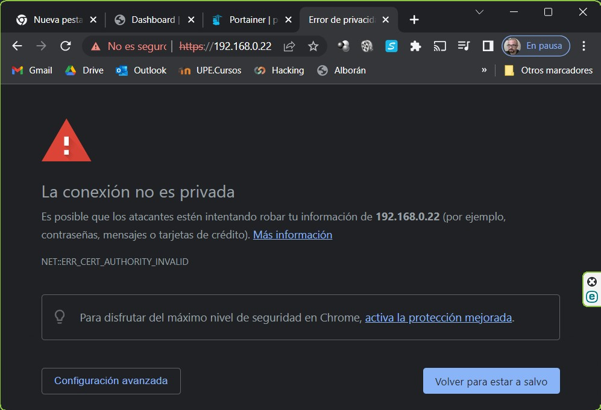
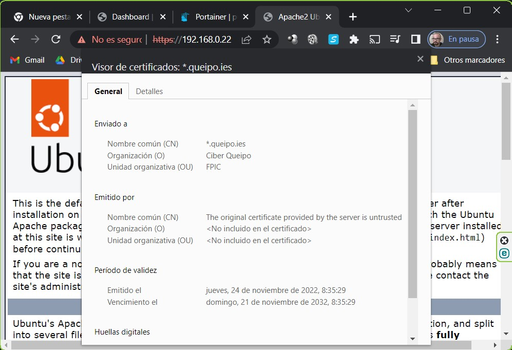

- [**Infraestructura**](#infraestructura)
  - [Copiar información en contenedores](#copiar-información-en-contenedores)
- [**Certificados WEB**](#certificados-web)
  - [Solicitud del certificado](#solicitud-del-certificado)
  - [Firma del certificado](#firma-del-certificado)
  - [Configuración de WEB en la parte cliente](#configuración-de-web-en-la-parte-cliente)
  - [Autenticación WEB con certificado digital](#autenticación-web-con-certificado-digital)

# **Infraestructura**

Este guión de prácticas se basa en un servidor Apache sobre Ubuntu Server montado en una instancia de Docker.

Cada alumno tiene en la ruta /home/ciber/alumnos una carpeta con su nombre, que está mapeada al contenedor `httpd:latest` que tiene su nombre. 

Podemos gestionar la máquina desde consola o desde Portainer: 

- URL `https://<ipCiber>:9443`
- User: `admin/ciberqueipo` 
- SSH `ciber@<ipCiber>`
- User: `ciber/ciber` 

## Copiar información en contenedores

Para copiar un fichero desde local a un contenedor:

```BASH
docker cp RUTA_LOCAL NOMBRE_CONTENEDOR:RUTA_DEL_CONTENEDOR
```

Para copiar desde contenedor a local 

```BASH
docker cp NOMBRE_CONTENEDOR:RUTA_DEL_CONTENEDOR RUTA_LOCAL
```

# **Certificados WEB**

El proceso de autenticar la conexión de un servidor WEB es similar a la emisión de un certificado digital para un usuario, pero el fichero de configuración cambia para ser usado como cifrado web.

Debemos disponer previamente de una clave privada de la organización, y de una CA que nos certifique la autenticidad del certificado. 

En este ejemplo vamos a emplear `DemoCA` como CA Raiz, y `user_privatekey.pem` como clave privada de la organización.

## Solicitud del certificado

Solicitud del certificado por parte del cliente.

```BASH
openssl req -new -key user_priv_key.pem -passin pass:1234 -subj "/C=ES/ST=Melilla/L=Melilla/O=Ciber Queipo/OU=FPIC/CN=*.queipo.ies/emailAddress=fpic@queipo.ies" -out web_cert.pem
```
Este certificado se envía a la CA Raíz con una petición de certificado con uso de cifrado WEB.

## Firma del certificado

La CA Raíz crea el fichero de configuración `config_web.cfg`

```BASH
[ my_extensions ]
basicConstraints = critical, CA:FALSE
extendedKeyUsage = critical, serverAuth
```

Se firma el fichero de configuración y se remite al cliente

```BASH
openssl x509 -CA ../cacert.pem -CAkey ../private/cakey.pem -passin pass:1234 -req -in ./web_cert.pem -days 3650 -extfile ./config_web.cfg -sha512 -CAserial ../serial -out webCertificate.pem
```
## Configuración de WEB en la parte cliente

Copiamos la clave privada de la empresa y el certificado web de la empresa en carpetas accesibles por `apache2`.

```BASH
cp webCertificate.pem /etc/ssl/certs/
cp user_priv_key.pem /etc/ssl/private/
```
Modificamos el fichero de configuración del sitio `ssl` de apache2

```BASH
nano /etc/apache2/sites-available/default-ssl.conf
# Agregamos las siguiente líneas
/etc/ssl/certs/webCertificate.pem
/etc/ssl/private/user_priv_key.pem
```

Creamos un enlace simbólico en la carpeta de las páginas disponibles del fichero de configuración `default-ssl.conf`

```BASH
cd /etc/apache2/sites-enabled
ln -s ../sites-available/default-ssl.conf 001-default.conf
```

Reiniciamos Apache. Al reiniciar el servicio nos pedirá la clave del certificado privado de la empresa.

```BASH
service apache2 restart
```

Desde un navegador accedemos a la WEB para comprobar que está todo correcto.





## Autenticación WEB con certificado digital

-- TO DO --

```BASH
echo "SOLICITAR CERTIFICADO CLIENTE AUTENTICACIÓN CONTRA WEB"
echo "---------------Se configura /CN=<nombre alumno>"
echo "ENVIAR PETICION A CA"

echo "GENERAR FICHERO DE CONFIGURACIÓN"

echo "FIRMAR CERTIFICADO"

echo "CONVERTIR CERTIFICADO A FORMATO PKCS12"

echo "ENVIAR AMBOS CERTIFICADOS A CLIENTE"

echo "MODIFICAR FICHERO /etc/apache2/sites-available/defalul-ssl.conf "
echo " - AGREGAR LA VERIFICACION SSL DEL CLIENTE"
echo "--------------descomentar línea SSLVerifyClient require"
echo " - AGREGAR CLAVE PUBLICA DE LA CA"
echo "--------------copiar cacert.pem al directorio adecuado"
echo "--------------SSLCACertificateFile /etc/apache2/ssl.crt/cacert.pem"
echo "REINICIAR APACHE"

echo "AGREGAR CERTIFICADO CLIENTE A NAVEGADOR"
echo "ACCEDER A LA WEB SEGURA"
```