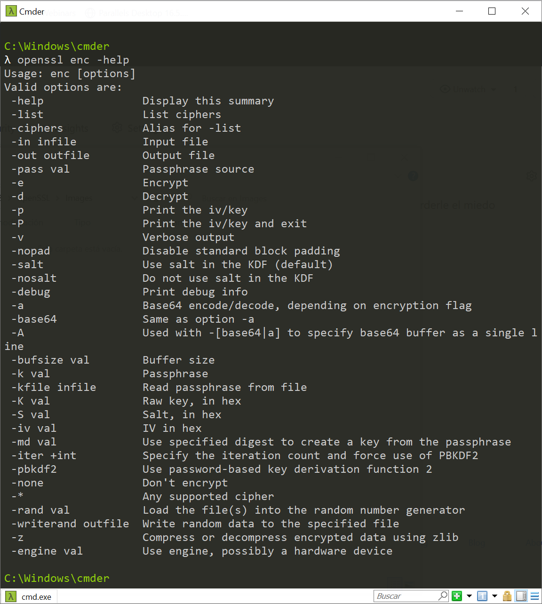
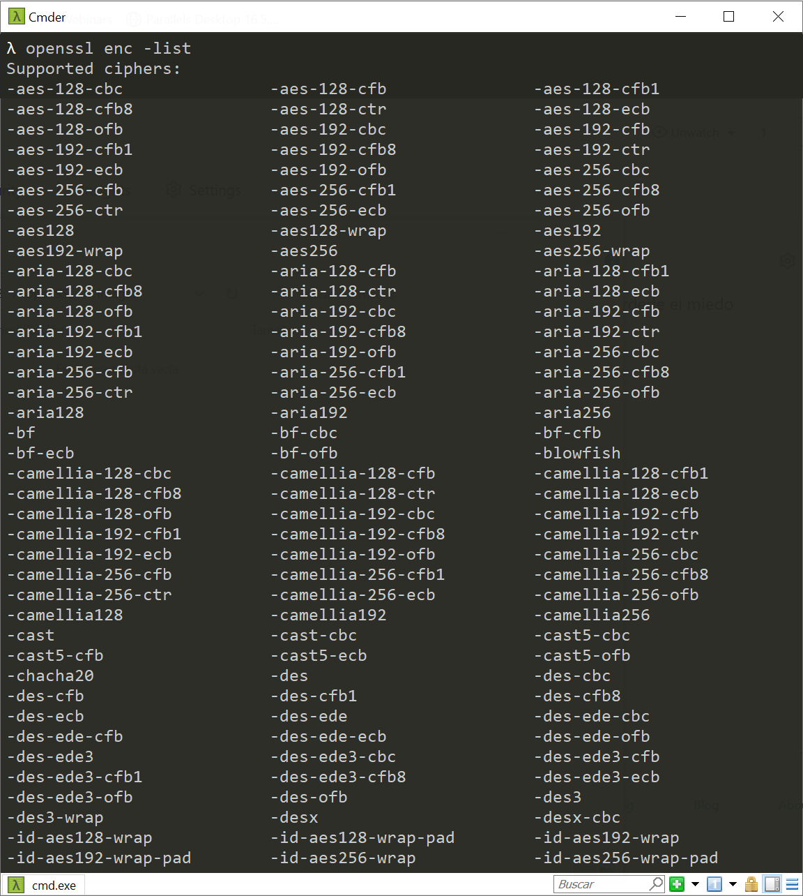

# Cifrado Simétrico

En criptografía, el cifrado es un procedimiento que utiliza un algoritmo de cifrado con cierta clave (clave de cifrado) para transformar un mensaje, sin atender a su estructura lingüística o significado, de tal forma que sea incomprensible o, al menos, difícil de comprender a toda persona que no tenga la clave secreta (clave de descifrado) del algoritmo.

Los algoritmos de clave simétrica usan la misma clave para cifrar y descifrar datos.

OpenSSL soporta varios algoritmos de clave simétrica como:
- DES
- 3DES
- IDEA
- Blowfish
- AES

Cada algoritmo de clave simétrica puede ser invocado desde la línea de comandos pasando el nombre del algoritmo en el comando openSSL

## Cifrado 

Para cifrar un archivo emplearemos la siguientes sintaxis

<code>openssl enc `<algoritmo de cifrado>` -e  -iter `<numero>` -in `<archivoacifrar>` -out `<archivocifrado>` </code>

Los métodos de cifrado los podemos ver:

<code>openssl enc -list</code>

## Descifrado

Para descifrar un archivo emplearemos la siguiente sintaxis:

<code>openssl enc `<algoritmo de cifrado>` -d  -iter `<numero>` -in `<archivoadescifrar>` -out `<archivodescifrado>` </code>

## Parámetros 

Para obtener un listado de todos los parámetros para cifrar con emplearemos `openssl enc -help` 

## Envío de adjuntos por mail

En ocasiones se envían archivos cifrados por mail para intercambiar datos de forma segura, esto puede ser un problema a la hora de incluir estos datos en un mail, para resolver este problema podemos usar el estándar base64 que es
soportado por OpenSSL y representa el binario cifrado por texto en ASCII

<code>openssl enc `<algoritmo de cifrado>` -e  -iter `<numero>` -base64 -in `<archivoadescifrar>` -out `<archivocifrado>`  </code>

# Ejemplos

Cifrado del documento `text.txt` con cifrado `aes128` y codificado como `base64`.

<code>openssl enc -aes128 -e -iter 20 -base64 -in text.txt -out text.enc</code>

Cifrado de un archivo mediante clave aleatoria almacenada en un fichero.

<code>openssl enc -aes-256-cbc -e iter 20 -in text.txt -pass file:clavesimetrica.key -out text.enc </code>

Generación de una clave aleatoria

<code>openssl rand 1024 > clavesimetrica.key </code>
